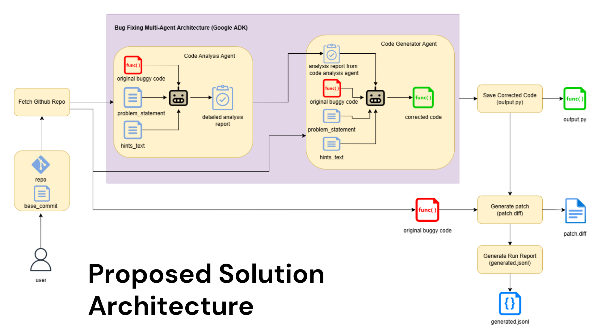
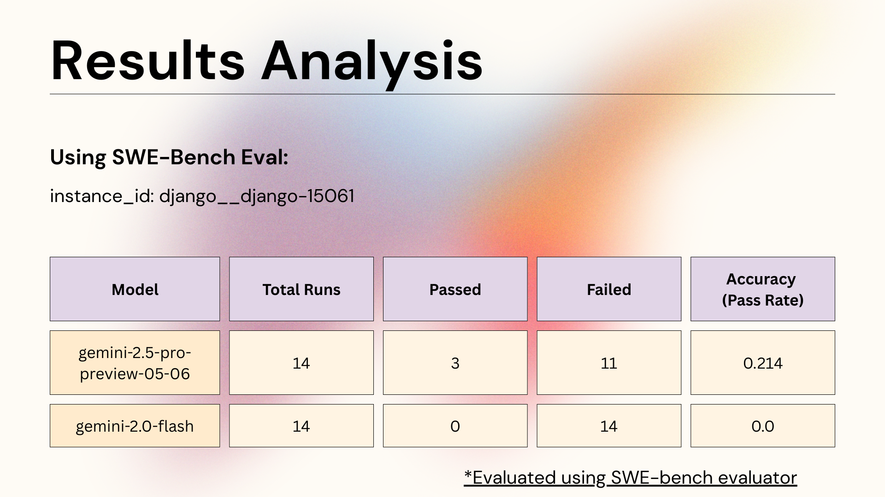

# Multi-Agent Bug Fixing Framework (Leveraging Google ADK)

This project implements a multi-agent system designed to automatically identify and fix bugs in code, utilizing components from the Google Agent Development Kit (ADK).

##  Multi-Agent Bug Fixing Architecture

### 🎬 Video Demonstration
*Click below to watch the demonstration video:*

[](https://youtu.be/GMbT9j8fp3M)

Below is a diagram illustrating the high-level architecture of the multi-agent bug fixing system.



## 🚀 Getting Started

Follow these steps to set up your environment and run the bug-fixing agent.

### 📝 Platform Note

**Important:** The following instructions and commands have been tested and are primarily written for a **Windows 11** environment. While many steps will be similar for macOS and Linux, path separators (`\` vs. `/`) and specific shell commands (especially for environment activation and saving path in generated.jsonl) will differ. Users on other operating systems may need to adapt certain commands accordingly.

### 1. Environment Setup

First, create a new Python virtual environment. This project requires Python 3.11 or 3.12.

```bash
python -m venv myenv
```

### 2. Activate Environment

Activate the newly created virtual environment.

*   **Windows:**
    ```bash
    myenv\Scripts\activate
    ```
*   **macOS/Linux (Example):**
    ```bash
    source myenv/bin/activate
    ```

### 3. Install Dependencies

Install the necessary Python packages listed in the `requirements.txt` file.

```bash
pip install -r requirements.txt
```

### 4. Configure API Credentials

This project requires API credentials for Google's Generative AI models. You need to set up a `.env` file in the directory `bug_fixer_agent`. Create a file named `.env` and add the following content based on your chosen method:

**Option 1: Using Gemini with Google AI Studio (Default)**

This is the default configuration and uses an API key.

```env
GOOGLE_GENAI_USE_VERTEXAI=FALSE
GOOGLE_API_KEY=PASTE_YOUR_ACTUAL_API_KEY_HERE
```
Replace `PASTE_YOUR_ACTUAL_API_KEY_HERE` with your actual Google AI Studio API key.

**Option 2: Using Gemini with Google Cloud Vertex AI**

If you prefer to use Vertex AI, configure your `.env` file as follows:

```env
GOOGLE_GENAI_USE_VERTEXAI=TRUE
GOOGLE_CLOUD_PROJECT=YOUR_PROJECT_ID
GOOGLE_CLOUD_LOCATION=LOCATION
```
Replace `YOUR_PROJECT_ID` with your Google Cloud Project ID and `LOCATION` with your Vertex AI region (e.g., `us-central1`).

**Important for Vertex AI:**
If you choose this option, you also need to:
1.  Ensure you have a service account key file named `sa-key.json` in the `bug_fixer_agent/` directory.
2.  Uncomment line 12 in the `bug_fixer_agent/agent.py` file. This line is:
    ```python
    # os.environ["GOOGLE_APPLICATION_CREDENTIALS"] = "bug_fixer_agent/sa-key.json"
    ```
    Change it to:
    ```python
    os.environ["GOOGLE_APPLICATION_CREDENTIALS"] = "bug_fixer_agent/sa-key.json"
    ```

### 5. Data Preparation: Extracting a Buggy Code Sample

To work with a specific bug instance, you'll need to clone the SWE-bench Lite dataset and extract a data point.

a.  Clone the SWE-bench Lite dataset repository:

    ```bash
    git clone https://huggingface.co/datasets/SWE-bench/SWE-bench_Lite
    ```

b.  Extract a "single-file" bug from the test dataset. The following script will fetch a specific data row and save it as `data.json` in the `bug_fixer_agent/` directory.

    ```bash
    python fetch_data_row.py
    ```
    *This script is assumed to be in your repository and configured to fetch the desired bug instance by instance_id from the test dataset.*

### 6. Running the Bug-Fixing Agent

Once the environment is set up and the data is prepared (`data.json` exists), you can run the multi-agent system.

```bash
python main.py --use_problem_statement --original_file django\django\forms\widgets.py
```

**Argument Explanations:**

*   `--use_problem_statement`: This flag instructs the agent to automatically load the problem description from the `data.json` file generated in the previous step.
*   `--original_file django\django\forms\widgets.py`: This argument specifies the path to the original buggy code file within the cloned SWE-bench Lite dataset.

## 📊 Results and Evaluation Outputs

After the agent completes its run, the following outputs will be generated in the `results/` directory:

*   `results/output.py`: This file contains the corrected code generated by the agent.
*   `results/patch.diff`: This file shows the differences (a patch) between the original buggy code and the agent's proposed fix.
*   `results/generated.jsonl`: This JSONL file is formatted for use with the SWE-bench evaluation harness.

### Evaluating the Fix

To formally evaluate the generated patch, you can use the official SWE-bench evaluation script.

Follow the original documentation for SWE-bench and setup a new environment.

    ```bash
    python -m swebench.harness.run_evaluation --dataset_name "princeton-nlp/SWE-bench_Lite" --predictions_path "results\generated.jsonl" --swe_bench_tasks "SWE-bench_Lite\" --log_dir "logs\run_evaluation" --max_workers 8 --run_id "my_bugfix_evaluation"
    ```

    *   `--swe_bench_tasks "SWE-bench_Lite\"`: Points to the directory where your SWE-bench Lite dataset was cloned.
    *   `--log_dir "logs\run_evaluation"`: Specifies the directory for detailed evaluation logs.
    *   `--run_id "my_bugfix_evaluation"`: A custom identifier for your evaluation run.

For more details on the evaluation process, refer to the [SWE-bench Evaluation Guide](https://www.swebench.com/SWE-bench/guides/evaluation/).

## 📈 Evaluation Results

The detailed evaluation results using the SWE-bench harness, are summarized in the table below:



## 📝 Logging

*   **Evaluation Summary Logs:** A summary of the evaluation run can be found in the directory specified by `--log_dir` during evaluation (e.g., `logs\run_evaluation\`).

---
